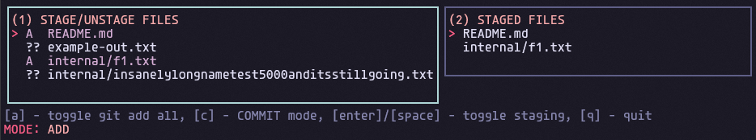

# Gitsage

Plenty of tools exist that do everything this tool can do? But let's be real, you're not a git pro, neither am I. We don't need all those features, we just want to add, commit, push with the least amount of input possible, especially when you're working alone! Gitsage does exactly that.





## Installation

### Linux

(Working on an install script)
Download the binary from releases and add to your path probably in ```usr/local/bin```

### Windows
1. Download the windows release
2. Move to a place of your choice
3. Edit environment variables
4. Add a new PATH to the binary you just placed

```bash
  npm install my-project
  cd my-project
```
    
## Usage

Run 
```
gs
```
Note: Works best if your terminal has some height and width. Issues occur on very thin terminals.

## Keyboard Controls


| Key                      | Action                          |
|--------------------------|----------------------------------|
| `Enter` / `Space`        | Stage/unstage selected file      |
| `A`                      | Stage/unstage **all** files      |
| `C`                      | Enter COMMIT mode                |
| `Esc`                    | Return to ADD mode           |
| `Enter` (in commit mode) | Commit with typed message        |
| `Q`                      | Quit the program                 |


## Coming Soon

- Push Support
- Branch Viewer
- Themes (Unsure)


## Contributing

Contributions are always welcome!
You can fork, add your own features if you like.
